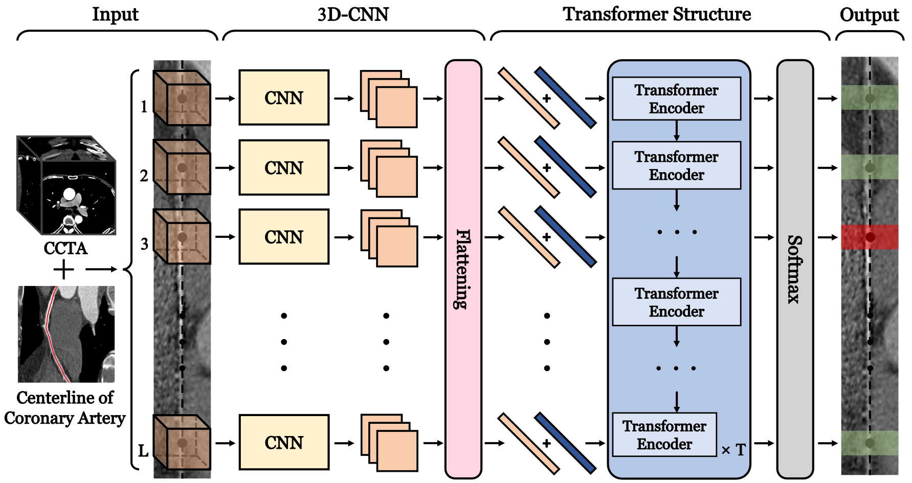

# Transformer Network for Significant Stenosis Detection in CCTA of Coronary Arteries

The implementation of our MICCAI2021 paper ["Transformer Network for Significant Stenosis Detection in CCTA of Coronary Arteries"](https://arxiv.org/abs/2107.03035).
 

<p align="center">
    
</p>

## Requirements  

Python 3.6, PyTorch 1.6 and other common packages are listed in [`requirements.txt`](requirements.txt)

## Usage
Volume sequences can be obtained from MPR images through [`data_maker.py`](data_maker.py).

Cubic volumes are flattened and combined with the corresponding labels to consist of a 1D vectors, and image information sequences are obtained by concatenating these vectors.

Both training data and test data are saved as numpy arrays of shape (D, L, N^3), where D indicates the number of data on centerline-level.

The path of training data and test data can be set in [`config.py`](config.py), for example:

```
train_dataset_root = './dataset/train_dataset.npy'
test_dataset_root = './dataset/test_dataset.npy'
```

## Citation

Please consider citing the project in your publications if it helps your research. The following is a BibTeX reference. The BibTeX entry  requires the `url` LaTeX package.

```latex
@article{ma2021transformer,
  title={Transformer Network for Significant Stenosis Detection in CCTA of Coronary Arteries},
  author={Ma, Xinghua and Luo, Gongning and Wang, Wei and Wang, Kuanquan},
  journal={arXiv preprint arXiv:2107.03035},
  year={2021}
}

```